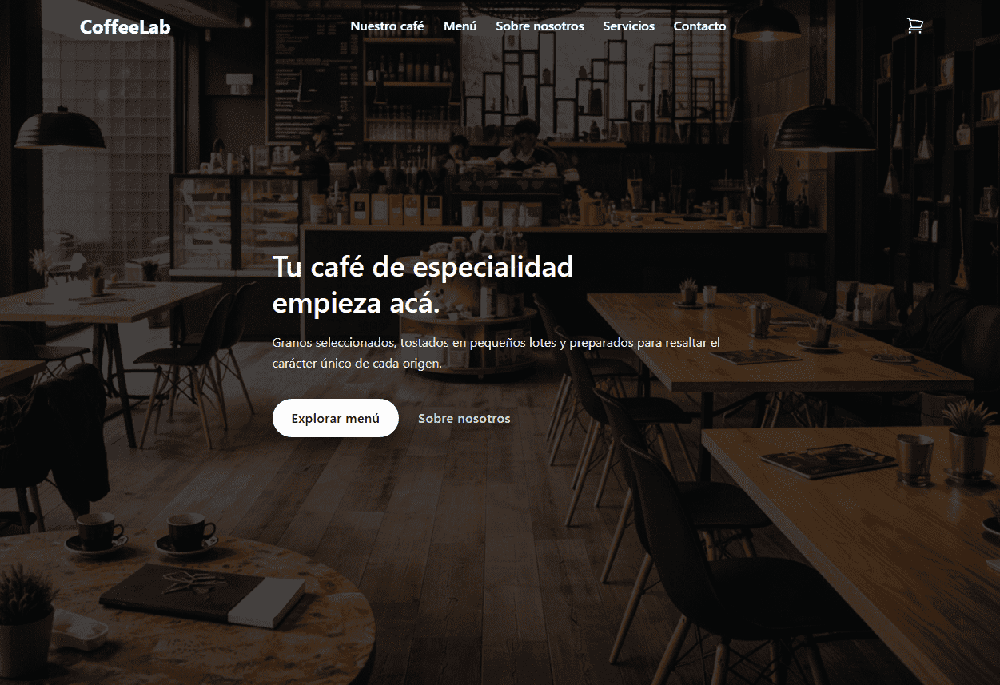

# ☕ CoffeeLab --- Landing Moderna con Carrito Inteligente

Una **landing page de alto rendimiento construida con React + Vite**,
diseñada con enfoque en experiencia de usuario, animaciones fluidas y un
flujo de compra realista con carrito, checkout y pantalla de éxito.
Pensada para producción y trabajo colaborativo en equipo.

::: {align="center"}


:::

------------------------------------------------------------------------

## 🌐 Demo en Producción


> 🚀 **URL de Producción:** *\[https://coffeelab-store.netlify.app/\]*\
> 📸 **Vista previa del proyecto:**\
> 

------------------------------------------------------------------------

## ✨ Descripción del Proyecto

**CoffeeLab Landing** es una aplicación web moderna que simula la
experiencia completa de compra en un ecommerce ligero, incluyendo:

-   Navegación por productos
-   Carrito de compras persistente
-   Flujo de checkout paso a paso
-   Pantalla de éxito post-compra
-   Generación de comprobante en PDF
-   Animaciones y microinteracciones
-   Diseño totalmente responsive

El objetivo principal fue construir una base sólida, escalable y
profesional para futuros proyectos de comercio electrónico.

------------------------------------------------------------------------

## 🚀 Características Clave

-   🛒 **Carrito funcional global** con React Context
-   💳 **Checkout + página de Success**
-   🎬 **Animaciones fluidas** con Framer Motion
-   🎨 **Diseño moderno con Tailwind CSS v4**
-   🔀 **Rutas SPA con React Router v7**
-   📄 **Generación de recibo en PDF con jsPDF**
-   📱 **Mobile First y totalmente responsive**
-   ⚡ **Alto rendimiento con Vite + SWC**
-   🌿 **Flujo Git profesional (feature → develop → main)**

------------------------------------------------------------------------

## 🏗️ Arquitectura Técnica

### Flujo de ramas (Git Workflow)

    main        → Producción
    develop     → Integración y pruebas
    feature/*   → Desarrollo aislado por características

Flujo recomendado:

    feature/* → develop → main → deploy

### Arquitectura Frontend

-   **Estado global:** React Context para el carrito
-   **Hooks personalizados:** Manejo de lógica de negocio
-   **Rutas:** React Router con layouts y páginas
-   **Estilos:** Tailwind CSS v4 (utility-first)
-   **Animaciones:** Framer Motion para transiciones y
    microinteracciones
-   **PDF:** jsPDF para comprobantes de compra
-   **Build:** Vite + SWC para máxima velocidad

------------------------------------------------------------------------

## 🛠️ Stack Tecnológico

  Capa                 Tecnología
  -------------------- -----------------
  UI                   React 19
  Bundler              Vite 7
  Estilos              Tailwind CSS v4
  Animaciones          Framer Motion
  Ruteo                React Router v7
  PDF                  jsPDF
  Gestor de paquetes   PNPM
  Despliegue           Netlify
  Linter               ESLint

------------------------------------------------------------------------

## 📁 Estructura del Proyecto

    .
    ├── dist/
    ├── node_modules/
    ├── public/
    ├── src/
    │   ├── assets/
    │   ├── components/
    │   │   └── Cart/
    │   ├── context/
    │   ├── data/
    │   ├── hooks/
    │   ├── icons/
    │   ├── layouts/
    │   ├── pages/
    │   └── utils/
    │   ├── App.css
    │   └── main.jsx
    ├── index.html
    ├── vite.config.js
    ├── eslint.config.js
    ├── pnpm-lock.yaml
    ├── netlify.toml
    └── .gitignore

------------------------------------------------------------------------

## 🏗️ Cómo se creó el proyecto

### 1️⃣ Crear la app con Vite

Desde la raíz del monorepo:

``` bash
pnpm create vite apps/coffeelab-landing
```

Seleccionar: - **Framework:** React\
- **Variante:** JavaScript + SWC

Luego:

``` bash
cd apps/coffeelab-landing
pnpm dev
```

### 2️⃣ Integrar Tailwind CSS v4

``` bash
pnpm add -D tailwindcss @tailwindcss/vite
```

**vite.config.js**

``` js
import { defineConfig } from 'vite'
import react from '@vitejs/plugin-react'
import tailwindcss from '@tailwindcss/vite'

export default defineConfig({
  plugins: [
    react(),
    tailwindcss(),
  ],
})
```

**App.css**

``` css
@import "tailwindcss";
```

------------------------------------------------------------------------

## 📦 Dependencias principales

``` json
{
  "framer-motion": "^12.31.1",
  "jspdf": "^4.1.0",
  "react": "^19.2.0",
  "react-dom": "^19.2.0",
  "react-router-dom": "^7.13.0",
  "tailwind-scrollbar-hide": "^4.0.0"
}
```

------------------------------------------------------------------------

## 🧪 Scripts de Desarrollo

``` bash
pnpm dev       # Iniciar servidor local
pnpm build     # Generar build de producción
pnpm preview   # Previsualizar build
pnpm lint      # Ejecutar ESLint
```

------------------------------------------------------------------------

## 🌍 Despliegue en Netlify

1.  Conectar el repositorio de GitHub a Netlify\
2.  Configurar:
    -   **Build command:** `pnpm build`
    -   **Publish directory:** `dist/`
3.  Desplegar 🚀

------------------------------------------------------------------------

## 🤝 Contribución

1.  Crear una rama desde `develop`
2.  Implementar la feature
3.  Pushear a GitHub
4.  Abrir Pull Request hacia `develop`
5.  Revisar → Aprobar → Merge → Deploy

------------------------------------------------------------------------

## 🎯 Aprendizajes Clave del Proyecto

-   Organización clara de código con React y Vite
-   Manejo de estado global con Context
-   Integración de animaciones profesionales con Framer Motion
-   Implementación de flujo de compra realista
-   Trabajo colaborativo con Git y ramas por feature

------------------------------------------------------------------------

## 📄 Licencia

MIT
